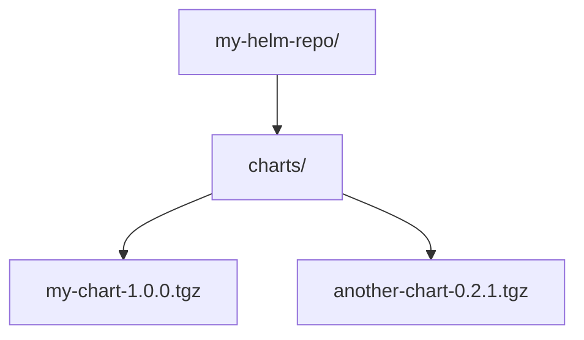

# Hosting Helm Charts via GitHub Pages

This guide explains how to host your own Helm chart repository using GitHub Pages, so you can use `helm repo add` in your Kubernetes clusters.

---

## 1. Project Structure

Organize your repository like this:



---

## 2. Generate the Helm Index

From the root of your repo (where the `CHARTS/` folder is):

```bash
helm repo index charts/ --url https://<username>.github.io/<repo-name>/charts

This creates a charts/index.yaml file with metadata about your charts.
```

#### Replace <username> with your GitHub username or org.

#### Replace <repo-name> with your GitHub repo name.


## 3. Commit and Push

Push the updated charts/ folder (with .tgz and index.yaml) to your repository:

```
git add CHARTS/
git commit -m "Add Helm charts and index.yaml"
git push origin <branch-name>
```

Note: Replace <branch-name> with the branch you want to use (e.g., main, dev, etc.).

## 4. Enable GitHub Pages

Go to your repository on GitHub:

1. Click Settings → Pages

2. Under Source, select your branch (e.g., main or dev)

3. Set the folder to /charts

4. Save

You will get a public URL like:
`
https://<username>.github.io/<repo-name>/charts
`

---
## 5. Use the Repo in Helm

Now in any Kubernetes environment:
```
helm repo add my-charts https://<username>.github.io/<repo-name>/CHARTS
helm repo update
```

### Install a chart with:
```
helm install my-release my-charts/my-chart
```
