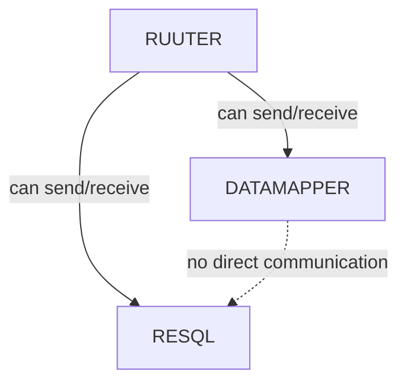

# NETWORK-001: Istio for Traffic Control and mTLS  

## Context  

Service-to-service communication in our Kubernetes cluster must be **secure, controlled, and observable**. Istio is used to enforce traffic rules and mutual TLS (mTLS) encryption, ensuring:  

- **Strict traffic policies** defining which services can communicate.  
- **Encrypted communication** between services for security and compliance.  
- **Enhanced observability** to monitor and audit network traffic.  

## Decision  

1. **Service-to-Service Traffic Control**  
   - **POD1** can send and receive traffic from **POD2** and **POD3**.  
   - **POD2** and **POD3** can only communicate with **POD1**, not with each other.
   - In Bürokratt project, `Ruuter` is component that acts as a central hub for traffic and orchestrates the flow. Example below.
   - Policies are enforced using **Istio Authorization Policies**.  

## Example


  


2. **mTLS for Secure Communication**  
   - All service-to-service communication must be encrypted using **mutual TLS (mTLS)**.  
   - Istio manages **automatic certificate rotation** and authentication.  

3. **Policy Enforcement via Istio**  
   - **Authorization Policies** define explicit service access rules.  
   - **Destination Rules** and **Virtual Services** control routing and retries.  

4. **Observability & Monitoring**  
   - **Istio Telemetry** provides logs, metrics, and distributed tracing.  
   - **Prometheus & Grafana** are used for monitoring Istio metrics.  

5. **Scalability & Maintainability**  
   - Policies must be **updated as services evolve** to ensure security.  
   - Service discovery and traffic rules are managed dynamically via Istio.  

## Example   

### **Use (Allowed Traffic Flow in Istio Policy)**  
```
apiVersion: security.istio.io/v1beta1
kind: AuthorizationPolicy
metadata:
  name: pod1-traffic-policy
  namespace: default
spec:
  action: ALLOW
  rules:
  - from:
    - source:
        principals: 
        - "cluster.local/ns/default/sa/pod2"
        - "cluster.local/ns/default/sa/pod3"
    to:
    - operation:
        methods: ["GET", "POST"]
        paths: ["/api/*"]
  selector:
    matchLabels:
      app: pod1
```

### **Forbidden (Pod2 and Pod3 Communicating Directly)**

```
apiVersion: security.istio.io/v1beta1
kind: AuthorizationPolicy
metadata:
  name: prevent-pod2-pod3-traffic
  namespace: default
spec:
  action: DENY
  rules:
  - from:
    - source:
        principals:
        - "cluster.local/ns/default/sa/pod2"
    to:
    - operation:
        methods: ["*"]
  selector:
    matchLabels:
      app: pod3
```

## Consequences  

### **Positive Outcomes**  
- **Enforced Security** – Blocks unauthorized communication between services.  
- **Encrypted Traffic** – Ensures compliance and prevents eavesdropping.  
- **Improved Observability** – Tracks service interactions and detects anomalies.  

### **Potential Trade-offs**  
- **Increased Complexity** – Istio requires additional setup and maintenance.  
- **Performance Overhead** – Encryption and policy enforcement introduce minimal latency.  
